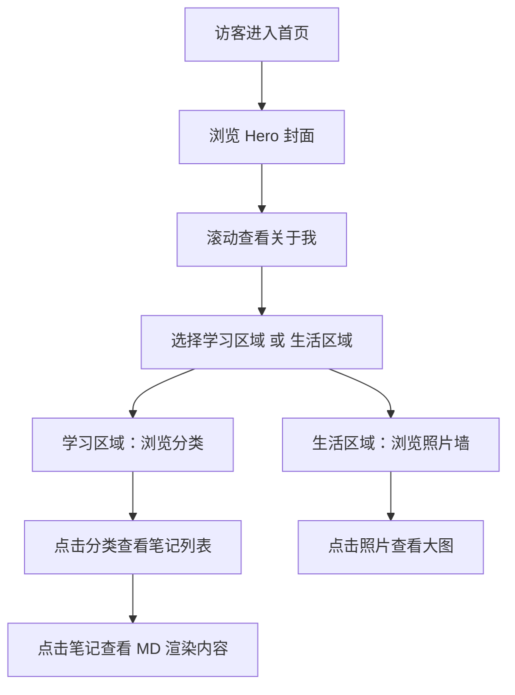

## 1. 产品概述

Hakii's Blog 是一个面向个人的学习生活博客网站，为大一计算机专业学生提供学习笔记整理与生活记录展示平台。网站融合极简黑白终端风格与艺术生活气息，兼具实用性与审美价值。

- 核心目标：打造一个集学习笔记分类管理、Markdown 渲染、生活照片展示于一体的个人门户
- 目标用户：作者本人及访客，用于个人知识沉淀与生活分享

## 2. 核心功能

### 2.1 用户角色
| 角色 | 访问方式 | 核心权限 |
|------|---------|---------|
| 访客 | 直接访问 | 浏览所有公开内容、查看笔记、浏览照片 |

### 2.2 功能模块
1. **首页/封面**：个人介绍、Hero 区域、导航入口
2. **学习区域**：分类笔记展示（前端、后端、嵌入式、视觉、数学、其他）、Markdown 渲染
3. **生活区域**：照片墙、生活记录展示
4. **导航系统**：全站导航、滚动动画、交互反馈

### 2.3 页面详情
| 页面名称 | 模块名称 | 功能描述 |
|---------|---------|---------|
| 首页 | Hero 封面区 | 个人头像/名字、简介（hakii / 大一 / 计算机专业）、打字机动画效果、终端风格装饰 |
| 首页 | 关于我 | 个人详细介绍、兴趣爱好、最近在做什么 |
| 学习区 | 分类导航 | 前端、后端、嵌入式、视觉、数学等分类卡片，点击进入对应分类 |
| 学习区 | 笔记列表 | 各分类下的笔记列表，支持预览 |
| 学习区 | Markdown 渲染 | 点击笔记可查看完整 MD 渲染内容 |
| 生活区 | 照片墙 | 瀑布流/网格布局展示生活照片，预留接口便于添加 |
| 生活区 | 生活记录 | 简短的生活文字记录 |
| 全局 | 导航栏 | 固定顶部/侧边导航，平滑滚动，当前位置高亮 |
| 全局 | 页脚 | 社交链接、版权信息 |

## 3. 核心流程

## 4. 用户界面设计

### 4.1 设计风格
- **主色调**：纯黑 `#000000` + 纯白 `#FFFFFF`，极简黑白配色
- **点缀色**：终端绿 `#00ff00` 或 柔和米色 `#f5f5dc`（生活气息点缀）
- **按钮风格**：极简边框按钮，悬停时反色填充，终端风格下划线
- **字体**：等宽字体（JetBrains Mono / Fira Code）用于终端风格文字，衬线字体用于标题
- **布局风格**：终端/命令行启发式布局，大量留白，不对称构图，文字排版艺术化
- **图标风格**：极简线条图标，ASCII 艺术装饰元素

### 4.2 页面设计概览
| 页面名称 | 模块名称 | UI 元素 |
|---------|---------|---------|
| 首页 | Hero 封面 | 全屏高度，打字机效果名字，终端光标闪烁，个人信息逐行显示，背景细微噪点纹理 |
| 首页 | 关于我 | 左侧文字右侧留白，段落首字母放大，引用风格装饰 |
| 学习区 | 分类导航 | 卡片式布局，每个分类一个卡片，悬停上浮效果，分类名称 + 文章数量 |
| 学习区 | 笔记列表 | 列表式，标题 + 日期 + 摘要，左侧竖线装饰 |
| 学习区 | MD 详情 | 居中内容区，优雅的排版，代码高亮，返回按钮 |
| 生活区 | 照片墙 | 瀑布流布局，图片圆角，悬停放大，caption 淡入 |
| 全局 | 导航栏 | 顶部固定，半透明毛玻璃效果，当前页面下划线指示 |

### 4.3 响应式设计
- 桌面端（>1024px）：多列布局，侧边导航可选
- 平板端（768-1024px）：两列布局，顶部导航
- 移动端（<768px）：单列布局，汉堡菜单导航，照片墙单列

### 4.4 动效与交互
- 页面加载：元素渐入，错开延迟
- 滚动触发：内容区随滚动淡入上移
- 悬停效果：按钮反色、卡片上浮、图片微放大
- 终端效果：打字机文字、闪烁光标、命令行提示符装饰
- 平滑滚动：导航跳转平滑过渡
