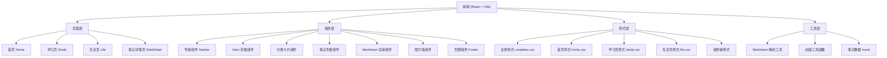

## 1. 架构设计



## 2. 技术选型说明

- **前端框架**：React 18 + TypeScript
- **构建工具**：Vite 5
- **样式方案**：Tailwind CSS 3 + 独立 CSS 文件（按模块分类）
- **路由管理**：React Router DOM 6
- **状态管理**：Zustand（轻量状态管理）
- **Markdown 渲染**：react-markdown + remark-gfm + rehype-highlight
- **图标库**：lucide-react
- **后端**：无（纯静态前端，数据通过 JSON/markdown 文件管理）

## 3. 目录结构

```
person_blog/
├── public/
│   ├── notes/              # Markdown 笔记文件
│   │   ├── frontend/       # 前端笔记
│   │   ├── backend/        # 后端笔记
│   │   ├── embedded/       # 嵌入式笔记
│   │   ├── vision/         # 视觉笔记
│   │   └── math/           # 数学笔记
│   └── images/
│       ├── life/           # 生活照片
│       └── avatar/         # 头像等
├── src/
│   ├── components/         # 可复用组件
│   │   ├── Navbar/
│   │   ├── Hero/
│   │   ├── CategoryCard/
│   │   ├── NoteList/
│   │   ├── MarkdownRenderer/
│   │   ├── PhotoWall/
│   │   └── Footer/
│   ├── pages/              # 页面组件
│   │   ├── Home/
│   │   ├── Study/
│   │   ├── Life/
│   │   └── NoteDetail/
│   ├── styles/             # 样式文件（分门别类）
│   │   ├── global.css      # 全局样式、变量
│   │   ├── components.css  # 组件通用样式
│   │   ├── animations.css  # 动画定义
│   │   └── pages/          # 页面级样式
│   │       ├── home.css
│   │       ├── study.css
│   │       └── life.css
│   ├── data/               # 数据配置
│   │   ├── categories.ts   # 学习分类配置
│   │   ├── notes.ts        # 笔记索引
│   │   └── photos.ts       # 生活照片数据
│   ├── utils/              # 工具函数
│   │   ├── markdown.ts
│   │   └── animation.ts
│   ├── App.tsx
│   ├── main.tsx
│   └── index.css
├── .trae/documents/        # 项目文档
├── package.json
├── vite.config.ts
├── tailwind.config.js
├── tsconfig.json
└── README.md
```

## 4. 路由定义

| 路由路径 | 页面组件 | 用途说明 |
|---------|---------|---------|
| `/` | Home | 首页 - 个人介绍、入口导航 |
| `/study` | Study | 学习区 - 分类导航、笔记列表 |
| `/study/:category` | Study | 指定分类的笔记列表 |
| `/note/:id` | NoteDetail | 笔记详情 - Markdown 渲染 |
| `/life` | Life | 生活区 - 照片墙、生活记录 |

## 5. 数据模型

### 5.1 学习分类 (Category)
```typescript
interface Category {
  id: string;
  name: string;
  nameEn: string;
  icon: string;
  description: string;
  noteCount: number;
  color: string;
}
```

### 5.2 笔记 (Note)
```typescript
interface Note {
  id: string;
  title: string;
  category: string;
  date: string;
  summary: string;
  filePath: string; // markdown 文件路径
  tags: string[];
}
```

### 5.3 照片 (Photo)
```typescript
interface Photo {
  id: string;
  src: string;
  alt: string;
  caption: string;
  date?: string;
  width: number;
  height: number;
}
```

## 6. 样式分类管理原则

1. **global.css**：CSS 变量、重置样式、基础排版、工具类
2. **animations.css**：所有 @keyframes 动画、动画类名
3. **components.css**：通用组件样式（按钮、卡片、标签等）
4. **pages/*.css**：各页面独有的样式，按页面拆分
5. 组件内使用 Tailwind 做快速布局，复杂样式抽离到 CSS 文件
