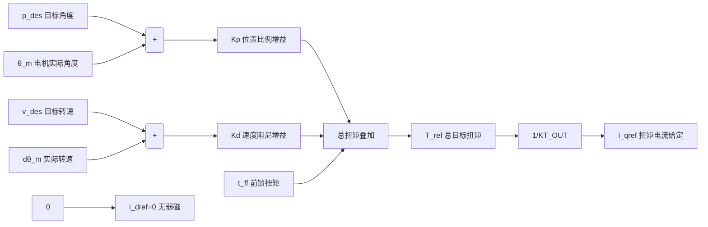
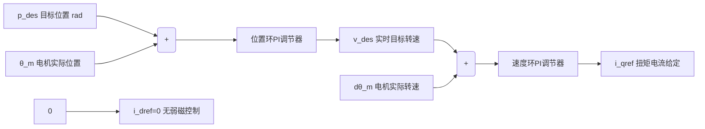
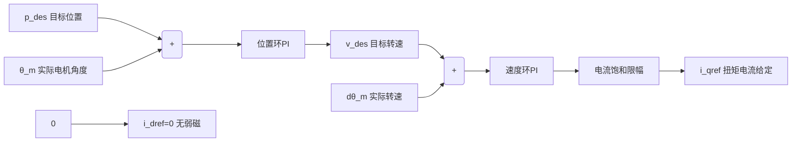

# DM-H3510 轮毂电机

## 物件

电机+转换板 

1、电机（含驱动）×1
2、电源+CAN 通信端子连接线：SH1.0 连接线-8pin (200mm)×1
3、调试串口信号线：SH1.0 连接线-3pin (200mm)×1
4、转换板(SH1.0 3pin+8pin 转XT30 +GH1.25)

终端电阻默认打开 用于can通信

## 工作模式

### MIT模式

MIT 模式是兼容原版 MIT 协议的复合控制算法，**位置、速度、扭矩三路并行解耦运算**，只需置零增益即可无缝切换定位 / 匀速 / 恒扭矩三种工作状态；无积分环节，靠前馈扭矩抵消负载阻力，动态响应快，多用于协作机械臂、柔性力控场景。

可实现 “定位置 + 恒速移动” 复合运动

总扭矩计算公式：
$$
(T_{ref}=K_p(p_{des}-\theta_m)+K_d(v_{des}-d\theta_m)+t_{ff})
$$
重要注意：做位置控制时\(K_d\)不能设 0，否则电机剧烈震荡甚至失控。

#### 上位机信号

### 上位机下发给定信号（CAN 发送）

1. \(p_{des}\)：目标位置 / 角度，想要电机到达的坐标；纯速度、扭矩模式下置零无影响。
2. \(v_{des}\)：目标转速，期望电机匀速运行的速度值。
3. \(t_{ff}\)：前馈补偿扭矩，提前抵消重力、摩擦、负载阻力，不用等产生位置偏差再修正。

#### 电机反馈信号

$$(\theta_m)$$：电机当前实际机械角度。

$$(d\theta_m)$$：电机实时转速，由角度微分算出。

#### 控制增益参数

#### 控制增益参数

$$(K_p)$$：位置比例增益，控制定位刚度，偏差越大输出矫正扭矩越强；纯速度、扭矩模式设为 0。

$$(K_d)$$：速度阻尼增益，作用是减震、抑制过冲、防止震荡；位置控制必须大于 0。

$$(KT_{OUT})$$：电机扭矩常数，电机固有参数，用来把扭矩换算成驱动电流。

#### 内部运算输出信号

$$(T_{ref})$$：三路叠加后的总参考扭矩，决定电机输出多大扭转力。

$$(i_{qref})$$：交轴电流给定，唯一负责产生扭矩的电流指令。

$$(i_{dref})$$：直轴电流给定，本模式固定为 0，不做高速弱磁，全部电流用来输出扭矩。

### 位置速度模式

**三环串级伺服架构**：最外层位置 PI 环、中层速度 PI 环、底层电流内环（图省略），环路串联，前一环输出作为后一环目标给定。上位机仅下发目标位置 $$(p_{des})$$，驱动器内部自动计算运动转速；$$(v_{des})$$ 仅作为全局最大转速限位。

两层环路都带积分 I，可自动消除摩擦、负重带来的定位静差

控制流程：

目标位置 → 位置 PI → 实时目标转速 → 速度 PI → 扭矩电流指令

\(i_{dref}\) 固定为 0，不开启弱磁，全部电流用于输出扭矩。

### 速度模式

最简单的PI控制器

速度模式能让电机稳定运行在设定的速度

### 力位混控模式

该模式是**位置速度串级模式的改良版本**，底层保留「位置 PI 外环 + 速度 PI 中环」标准串级结构，在速度 PI 输出后新增**电流饱和限幅环节**，以此限制电机最大输出扭矩。

逻辑特点：电机优先向目标位置运动；若途中碰到障碍物，输出扭矩会被限制在设定上限，不会持续大力硬顶，实现「定位 + 可控接触力」混合控制。

输入：

$$(\boldsymbol{p_{des}})$$：目标位置 / 目标角度（单位 rad）

电机理论上需要抵达的终点坐标，是位置环的给定值。

电流饱和限幅阈值（寄存器配置输入）

## 永磁同步电机

永磁同步电机三相电流，经过坐标变换，分解成**互相垂直（正交）** 的两路直流分量：

$$(i_d)$$（直轴电流）：沿转子磁铁磁场方向，只改变磁场强弱，**不产生旋转扭矩**

- $$(i_d=0)$$：完全不削弱 / 增强磁场，全部电流用来出力（你这款驱动器所有模式默认配置）
- $$(i_d<0)$$：弱磁，电机可以超额定高速转

$$(i_q)$$（交轴电流）：和转子磁场垂直，**唯一产生旋转扭力**，$$(i_q)$$ 越大，电机力气越大

总定子电流矢量：$$(i_s=\sqrt{i_d^2+i_q^2})$$

两路电流正交，互不干扰，分开控制磁场、扭矩。
