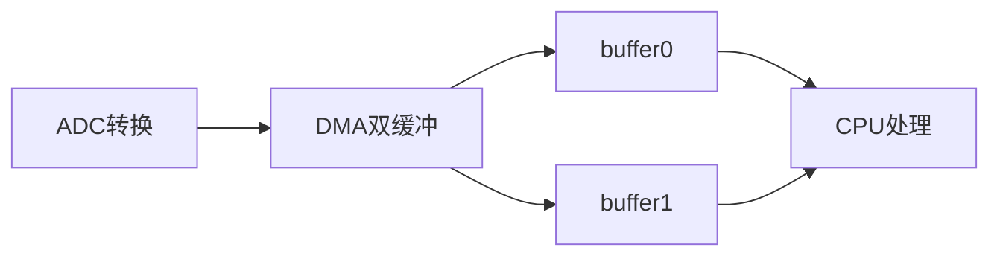

[TOC]

# DMA 双缓冲

## 简易原理图



单缓冲区和双缓冲区对比

| 特性               | 单缓冲区模式             | 双缓冲区模式       |
| ------------------ | ------------------------ | ------------------ |
| **数据传输连续性** | 需要CPU及时处理          | 自动切换，无缝衔接 |
| **内存占用**       | 1×数据块大小             | 2×数据块大小       |
| **CPU干预频率**    | 每个数据块传输完成都需要 | 仅缓冲区切换时需要 |
| **适用场景**       | 低速率简单传输           | 高速实时数据流     |

## 基础配置

```c
// DMA1_Stream5配置示例(以STM32F4为例)
DMA_HandleTypeDef hdma_adc;
    
hdma_adc.Instance = DMA1_Stream5;
hdma_adc.Init.Channel = DMA_CHANNEL_0;	//DMA1_Stream5 + DMA_CHANNEL_0 固定配对 ADC1
1. 两条代码分别是什么
hdma_adc.Init.Direction = DMA_PERIPH_TO_MEMORY; //传输方向：外设 → 内存
hdma_adc.Init.MemDataAlignment = DMA_MDATAALIGN_HALFWORD;//内存位宽 每次 DMA 往内存写 2 字节
hdma_adc.Init.MemInc = DMA_MINC_ENABLE; //内存地址自增
hdma_adc.Init.Mode = DMA_CIRCULAR;// 循环模式
hdma_adc.Init.PeriphDataAlignment = DMA_PDATAALIGN_HALFWORD;
hdma_adc.Init.PeriphInc = DMA_PINC_DISABLE;
hdma_adc.Init.Priority = DMA_PRIORITY_HIGH;//优先级
hdma_adc.Init.FIFOMode = DMA_FIFOMODE_DISABLE;
hdma_adc.Init.MemBurst = DMA_MBURST_SINGLE;
hdma_adc.Init.PeriphBurst = DMA_PBURST_SINGLE;

// 关键双缓冲区配置
hdma_adc.Instance->M0AR = (uint32_t)buffer0; // 内存地址0
hdma_adc.Instance->M1AR = (uint32_t)buffer1; // 内存地址1
hdma_adc.Instance->CR |= DMA_SxCR_DBM;// 启用双缓冲

```

## ADC双缓冲采集

### 硬件

STM32F407 ---- 模拟信号源
PA0(ADC1_IN0) <-- 信号输入
DMA1_Stream0--> 双缓冲区

```c
#define BUFFER_SIZE 1024
uint16_t adcBuffer0[BUFFER_SIZE];
uint16_t adcBuffer1[BUFFER_SIZE];
volatile uint8_t currentBuffer = 0; // 当前活动缓冲区标志

void ADC1_DMA_Init(void) {
// 1. ADC初始化
ADC_HandleTypeDef hadc1;
hadc1.Instance = ADC1;
hadc1.Init.ClockPrescaler = ADC_CLOCK_SYNC_PCLK_DIV4;
hadc1.Init.Resolution = ADC_RESOLUTION_12B;
hadc1.Init.ScanConvMode = ENABLE;
hadc1.Init.ContinuousConvMode = ENABLE;
hadc1.Init.DiscontinuousConvMode = DISABLE;
hadc1.Init.NbrOfConversion = 1;
hadc1.Init.DMAContinuousRequests = ENABLE;
HAL_ADC_Init(&hadc1);

// 2. DMA双缓冲配置
hdma_adc1.Instance = DMA2_Stream0;
hdma_adc1.Init.Channel = DMA_CHANNEL_0;
hdma_adc1.Init.Direction = DMA_PERIPH_TO_MEMORY;
hdma_adc1.Init.PeriphInc = DMA_PINC_DISABLE;
hdma_adc1.Init.MemInc = DMA_MINC_ENABLE;
hdma_adc1.Init.PeriphDataAlignment = DMA_PDATAALIGN_HALFWORD;
hdma_adc1.Init.MemDataAlignment = DMA_MDATAALIGN_HALFWORD;
hdma_adc1.Init.Mode = DMA_CIRCULAR;
hdma_adc1.Init.Priority = DMA_PRIORITY_HIGH;
hdma_adc1.Init.FIFOMode = DMA_FIFOMODE_DISABLE;
hdma_adc1.Init.MemBurst = DMA_MBURST_SINGLE;
hdma_adc1.Init.PeriphBurst = DMA_PBURST_SINGLE;
HAL_DMA_Init(&hdma_adc1);

// 3. 关联ADC和DMA
__HAL_LINKDMA(&hadc1, DMA_Handle, hdma_adc1);

// 4. 启动双缓冲传输
HAL_ADC_Start_DMA(&hadc1, (uint32_t*)adcBuffer0, BUFFER_SIZE);
HAL_DMAEx_MultiBufferStart_IT(&hdma_adc1,
(uint32_t)&ADC1->DR,
(uint32_t)adcBuffer0,
(uint32_t)adcBuffer1,
BUFFER_SIZE);
}

// DMA中断回调函数
void HAL_ADC_ConvHalfCpltCallback(ADC_HandleTypeDef* hadc) {
currentBuffer = 0; // 前半段完成，表示Buffer0已满
Process_Buffer(adcBuffer0); // 处理Buffer1
}

void HAL_ADC_ConvCpltCallback(ADC_HandleTypeDef* hadc) {
currentBuffer = 1; // 后半段完成，表示Buffer1已满
Process_Buffer(adcBuffer1); // 处理Buffer0
}

// 示例处理函数
void Process_Buffer(uint16_t* buf) {
for(int i=0; i<BUFFER_SIZE; i++) {
buf[i] = buf[i] * 3300 / 4095; // 转换为mV
}
}

```

## 串口DMA接收

### 单缓冲弊端

假设配置了256字节得缓冲区

```c
uint8_t rx_buffer[256];
HAL_UART_Receive_DMA(&huart1, rx_buffer, 256);

```

数据自动填满缓冲区后触发 `RxCpltCallback `，然后你在回调里处理数据。 由于处理数据需要时间，但是仍然在接受，而且没处理完，数据仍然在到来，会覆盖原本的数据。第257个字节来了 → 写入 `rx_buffer[0]`。

### 硬件双缓冲

```c
#define RX_BUF_LEN 128
// 双缓冲两块接收区
uint8_t rx_buf0[RX_BUF_LEN];
uint8_t rx_buf1[RX_BUF_LEN];
// 就绪标志
volatile uint8_t rx_ready = 0; // 1=buf0就绪 2=buf1就绪

UART_HandleTypeDef huart1;
DMA_HandleTypeDef hdma_usart1_rx;

//部分DMA初始化
// 绑定串口与DMA
    __HAL_LINKDMA(&huart1, hdmarx, hdma_usart1_rx);

    // 开启串口空闲中断
    __HAL_UART_ENABLE_IT(&huart1, UART_IT_IDLE);

    // 启动DMA双缓冲接收(带中断)
    HAL_DMAEx_MultiBufferStart_IT(&hdma_usart1_rx,
        (uint32_t)&USART1->DR,
        (uint32_t)rx_buf0,
        (uint32_t)rx_buf1,
        RX_BUF_LEN);

// 空闲中断回调
void HAL_UART_IdleCpltCallback(UART_HandleTypeDef *huart)
{
    if(huart->Instance == USART1)
    {
        // 获取当前正在写入的缓冲区
        if(hdma_usart1_rx.Instance->CR & DMA_SxCR_CT)
        {
            // CT=1 当前DMA写buf1，buf0已经收完整包
            rx_ready = 1;
        }
        else
        {
            // CT=0 当前DMA写buf0，buf1已经收完整包
            rx_ready = 2;
        }
        // 清除空闲中断标志
        __HAL_UART_CLEAR_IDLEFLAG(&huart1);
    }
}

```

DMA双缓冲传输完成回调

```c
// M0AR(buf0)填满触发TC全传输中断
void HAL_UART_RxCpltCallback(UART_HandleTypeDef *huart)
{
    if (huart->Instance == USART1)
    {
        rx_ready = 1; // buf0可用
    }
}

// M1AR(buf1)填满触发HT半传输中断
void HAL_UART_RxHalfCpltCallback(UART_HandleTypeDef *huart)
{
    if (huart->Instance == USART1)
    {
        rx_ready = 2; // buf1可用
    }
}

// 自定义数据解析函数
void Process_UART_Data(uint8_t *data, uint16_t len)
{
    // 在这里做协议解析、打印、数据运算
    HAL_UART_Transmit(&huart1, data, len, 100);
}
```

### 软件双缓冲

只用**1 个数组**，不开 DMA 双缓冲 DBM，靠数组前后两半模拟两块缓冲区；只用普通循环 DMA。

数组长度RX_BUF_LEN,前半段/2，后半段/2.

```c
#define RX_BUF_LEN 256
uint8_t rx_buf[RX_BUF_LEN]; // 只一个数组，软件对半拆分
volatile uint8_t rx_flag = 0; // 1=前半就绪，2=后半就绪

UART_HandleTypeDef huart1;
DMA_HandleTypeDef hdma_usart1_rx;

void USART1_SoftDoubleBuf_Init(void)
{
    // 串口初始化省略，和硬件双缓冲一致
    
    // DMA配置：Mode = DMA_CIRCULAR 循环模式，不开启DBM
    hdma_usart1_rx.Instance = DMA2_Stream2;
    hdma_usart1_rx.Init.Channel = DMA_CHANNEL_4;
    hdma_usart1_rx.Init.Direction = DMA_PERIPH_TO_MEMORY;
    hdma_usart1_rx.Init.PeriphInc = DMA_PINC_DISABLE;
    hdma_usart1_rx.Init.MemInc = DMA_MINC_ENABLE;
    hdma_usart1_rx.Init.PeriphDataAlignment = DMA_PDATAALIGN_BYTE;
    hdma_usart1_rx.Init.MemDataAlignment = DMA_MDATAALIGN_BYTE;
    hdma_usart1_rx.Init.Mode = DMA_CIRCULAR; // 循环，无DBM
    hdma_usart1_rx.Init.Priority = DMA_PRIORITY_MEDIUM;
    hdma_usart1_rx.Init.FIFOMode = DMA_FIFOMODE_DISABLE;
    hdma_usart1_rx.Init.MemBurst = DMA_MBURST_SINGLE;
    hdma_usart1_rx.Init.PeriphBurst = DMA_PBURST_SINGLE;
    HAL_DMA_Init(&hdma_usart1_rx);

    __HAL_LINKDMA(&huart1, hdmarx, hdma_usart1_rx);
    __HAL_UART_ENABLE_IT(&huart1, UART_IT_IDLE);

    // 普通循环DMA启动，不是MultiBuffer
    HAL_UART_Receive_DMA(&huart1, rx_buf, RX_BUF_LEN);
}

// 半传输：前半段 rx_buf[0~127] 满
void HAL_UART_RxHalfCpltCallback(UART_HandleTypeDef *huart)
{
    if(huart->Instance == USART1)
        rx_flag = 1;
}
// 全传输：后半段 rx_buf[128~255] 满
void HAL_UART_RxCpltCallback(UART_HandleTypeDef *huart)
{
    if(huart->Instance == USART1)
        rx_flag = 2;
}

// 空闲中断
void HAL_UART_IdleCpltCallback(UART_HandleTypeDef *huart)
{
    __HAL_UART_CLEAR_IDLEFLAG(huart);
    rx_flag = 3; // 不定长帧标记
}

// 主循环
while(1)
{
    uint8_t flag = rx_flag;
    if(flag == 1)
    {
        Process(rx_buf, RX_BUF_LEN/2);
        rx_flag = 0;
    }
    else if(flag == 2)
    {
        Process(rx_buf + RX_BUF_LEN/2, RX_BUF_LEN/2);
        rx_flag = 0;
    }
}
```

### 软硬件区分

软件双缓冲（单数组对半）

- HT：数组前一半填满

- TC：数组后一半填满

  两块区域共享同一块内存，存在覆盖风险

  

  硬件双缓冲（两块独立内存）

- TC：M0AR (buf0) 完整填满

- HT：M1AR (buf1) 完整填满

  

  两块内存完全隔离，DMA 写一块、CPU 读另一块，不会互相覆盖

**`HAL_UART_RxCpltCallback`、`HAL_UART_RxHalfCpltCallback` 都是 HAL 库预先定义的弱函数**。

不管你开不开硬件 DBM 双缓冲，只要 DMA 是循环模式 CIRCULAR，HT 半传输、TC 全传输中断本身就存在，硬件自带，和 DBM 无关。

### HT TC中断

前提配置：

DMA 模式配置为 `DMA_CIRCULAR` 循环模式

HAL 初始化时开启了传输完成中断（带_IT 的启动函数）

**TC 传输完成**：NDTR 计数降到 0，一整段长度收满

**HT 半传输完成**：NDTR 计数走到一半长度

## 环形缓冲区（FIFO）

双缓冲也会出现丢包得问题，在软件的双缓冲上会出现某一帧被缓冲区截断得情况，在硬件双缓冲会出现某一帧的部分被覆盖得情况，这时候可以采用环形FIFO来减少丢包的问题

整体架构

底层：DMA 硬件双缓冲 `buf0 / buf1`，DMA 自动搬运字节

分包层：TC/HT/IDLE 仅置标志，识别哪块缓冲区收完

缓存层：环形 FIFO，缓存多包，防止 DMA 覆盖未处理数据

业务层：主循环读取 FIFO 解析数据

宏与变量

```c
#include "stm32f4xx_hal.h"

// DMA双缓冲单块长度
#define DMA_BUF_LEN 128
// 环形FIFO总大小
#define FIFO_TOTAL_LEN 1024

// DMA双缓冲两块RAM
uint8_t dma_buf0[DMA_BUF_LEN];
uint8_t dma_buf1[DMA_BUF_LEN];

// 环形FIFO
uint8_t uart_fifo[FIFO_TOTAL_LEN];
uint16_t fifo_wr = 0;
uint16_t fifo_rd = 0;

// 缓冲区就绪标记 0无数据 1=buf0就绪 2=buf1就绪
volatile uint8_t buf_flag = 0;

UART_HandleTypeDef huart1;
DMA_HandleTypeDef hdma_usart1_rx;
```

初始化省略

DMA 缓冲区数据拷贝进环形 FIFO

```c
// 拷贝数据到环形缓冲区
static void Copy_To_Fifo(uint8_t *src, uint16_t len)
{
    for(uint16_t i = 0; i < len; i++)
    {
        // 判断FIFO是否满，满则丢弃防止溢出
        uint16_t next_wr = fifo_wr + 1;
        if(next_wr >= FIFO_TOTAL_LEN) next_wr = 0;
        if(next_wr == fifo_rd)
        {
            return; // FIFO满，直接退出
        }

        uart_fifo[fifo_wr] = src[i];
        fifo_wr = next_wr;
    }
}
```

DMA 传输完成回调（仅置标记）

```c
// buf0填满触发TC
void HAL_UART_RxCpltCallback(UART_HandleTypeDef *huart)
{
    if(huart->Instance == USART1)
        buf_flag = 1;
}
// buf1填满触发HT
void HAL_UART_RxHalfCpltCallback(UART_HandleTypeDef *huart)
{
    if(huart->Instance == USART1)
        buf_flag = 2;
}
```

空闲中断回调

```c
void HAL_UART_IdleCpltCallback(UART_HandleTypeDef *huart)
{
    if(huart->Instance != USART1) return;
    __HAL_UART_CLEAR_IDLEFLAG(huart);

    // CT=1 当前DMA写buf1 → buf0已收完
    if(hdma_usart1_rx.Instance->CR & DMA_SxCR_CT)
        buf_flag = 1;
    else
        buf_flag = 2;
}
```

主函数处理

```c
int main(void)
{
    HAL_Init();
    SystemClock_Config();
    MX_GPIO_Init();
    USART1_DMA_DoubleBuf_Init();

    while(1)
    {
        // 快照读取标记，防止中断覆盖丢失
        uint8_t flag = buf_flag;
        if(flag != 0)
        {
            if(flag == 1)
            {
                Copy_To_Fifo(dma_buf0, DMA_BUF_LEN);
            }
            else if(flag == 2)
            {
                Copy_To_Fifo(dma_buf1, DMA_BUF_LEN);
            }
            buf_flag = 0; // 拷贝完成清除标记
        }

        // 从环形FIFO取出数据解析
        if(fifo_wr != fifo_rd)
        {
            uint8_t dat = uart_fifo[fifo_rd];
            fifo_rd++;
            if(fifo_rd >= FIFO_TOTAL_LEN)
                fifo_rd = 0;

            /*
            fifo_wr = (fifo_wr + 1) % FIFO_TOTAL_LEN; if判断可以 取余操作也可以
            */
            
            
            // 这里写你的协议解析、打印、业务逻辑
            // Example: HAL_UART_Transmit(&huart1, &dat, 1, 10);
        }
    }
}
```
