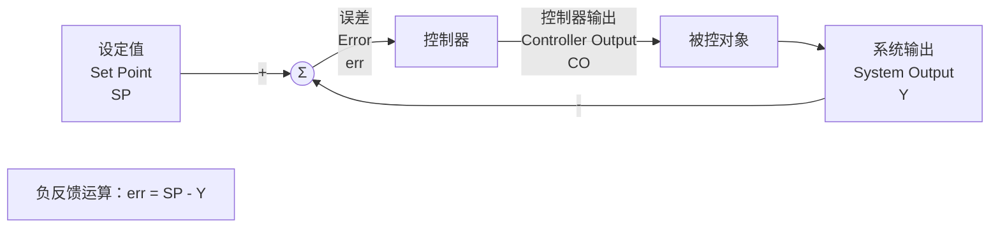
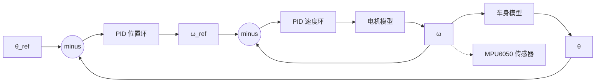

# PID_Advanced

## 控制系统

指标：

- 稳：受到干扰能够回归到稳态
- 准：稳态值偏离设定值小
- 快：达到稳态的速度

## 电机建模

### 电机化学方程

> 图示：电机电枢等效电路（电感 $L_a$、电阻 $R_a$、反电动势 $K_e \omega(t)$）
$$
\frac{d i_a(t)}{dt} + R_a i_a(t) = u_a(t) - K_e \omega(t)
$$
$(L_a)$：电枢电感，$(R_a)$：电枢电阻

$(i_a(t))$：电枢电流，$(u_a(t))$：电枢输入电压

$(K_e)$：反电动势系数，$(\omega(t))$：电机机械角速度

$(K_e \omega(t))$ 为电机转动产生的反电动势

### 电机机械方程

> 图示：电机机械模型（转动惯量 $J$、粘性摩擦 $B$、电磁转矩 $K_t i_a$、负载转矩 $T_L$）
$$
J \frac{d\omega(t)}{dt} + B \omega(t) = K_t i_a(t) - T_L
$$
J：电机转轴总转动惯量

B：粘性摩擦阻尼系数

$(\omega(t))$：电机机械角速度

$(K_t)$：电机转矩系数

$(i_a(t))$：电枢电流（电磁转矩 $(T_e=K_t i_a)）$

$(T_L)$：外部负载转矩 一般是空载

### 拉普拉斯变换

$$
\mathcal{L}\left[f(t)\right] = F(s)
\\
\mathcal{L}\left[f'(t)\right] = sF(s)
\\
\mathcal{L}\left[\int f(t) dt\right] = \frac{1}{s}F(s)
$$

电化学方程
$$
\mathcal{L}\left[ L_a \frac{d i_a(t)}{dt} + R_a i_a(t) \right] = \mathcal{L}\left[ u_a(t) - K_e \omega(t) \right]
\\
L_a \cdot \mathcal{L}\left[ \frac{d i_a(t)}{dt} \right] + R_a \cdot \mathcal{L}\left[ i_a(t) \right] = \mathcal{L}\left[ u_a(t) \right] - K_e \mathcal{L}\left[ \omega(t) \right]
\\
\left(L_a s + R_a\right) I_a(s) = U_a(s) - K_e \omega(s)
$$
机械方程
$$
\mathcal{L}\left[ J \frac{d\omega(t)}{dt} + B \omega(t) \right] = \mathcal{L}\left[ K_t i_a(t) \right] - T_L
\\
J \cdot \mathcal{L}\left[ \frac{d\omega(t)}{dt} \right] + B \cdot \mathcal{L}\left[ \omega(t) \right] = K_t \mathcal{L}\left[ i_a(t) \right] - T_L
\\
\left(J s + B\right) \omega(s) = K_t I_a(s) - T_L
$$

### 传递函数__结构图化简

输入：电压 			输出：角速度

> 图示：电机传递函数结构图化简（输入电压 → 输出角速度）
$$
\begin{cases}
(L_a s + R_a) I_a(s) \triangleq U_a(s) - K_e \omega(s) \quad  \\
(J s + B) \omega(s) = K_t I_a(s) - T_L \quad 
\end{cases}
$$
化简过程如下：
$$
I_a(s) = \frac{Js + B}{K_t} \omega(s)
\\
(L_a s + R_a)\frac{Js + B}{K_t}\omega(s) = U_a(s) - K_e \omega(s)
\\
\frac{(L_a s + R_a)(Js + B) + K_t K_e}{K_t}\omega(s) = U_a(s)
\\
\frac{\omega(s)}{U_a(s)} = \frac{K_t}{(L_a s + R_a)(Js + B) + K_t K_e}
$$
> 图示：传递函数最终化简结果

传递函数：
$$
\frac{k_t}{(L_a s + R_a)(J s + B) + k_t k_e}
$$

## 倒立摆

### 串级PID

#### 内外环

##### 响应快的量做内环，响应慢的量做外环

角速度 $(\dot\theta)$：陀螺仪直接测量，毫秒级就能变化，动态响应极快 → **内环**

角度 $(\theta)$：角度是角速度积分出来的，变化平缓、惯性大、响应慢 → **外环**

内环负责**快速抑制扰动**（角速度微小波动、电机力矩干扰），带宽更高、调节更快；外环负责**稳态精度**（把角度稳定在 0），带宽更低。

位置/角度（慢，外环） → 速度/角速度（快，内环） → 加速度/力矩（最内层）

##### 信号依赖关系判断

外环被控量 = 内环被控量的积分			积分量一定是外环，微分量 / 速率量一定是内环。		$(\theta = \int \dot\theta \mathrm{d}t)$

外环输入：$(\boldsymbol{\theta_{ref}})$   0rad

**反馈测量值 PV（过程输入）**：实际摆杆角度 $(\boldsymbol{\theta})$

外环输出：$(\boldsymbol{\dot\theta_{ref}})$ 角速度目标值

内环输入：角速度目标值

送入倒立摆动力学逆解模块：

$(\ddot x = \frac{l_p \ddot\theta + g \sin\theta}{\cos\theta})$

> 图示：PID控制 Simulink 仿真框图

> 图示：Simulink 仿真输出波形

### 代码实例