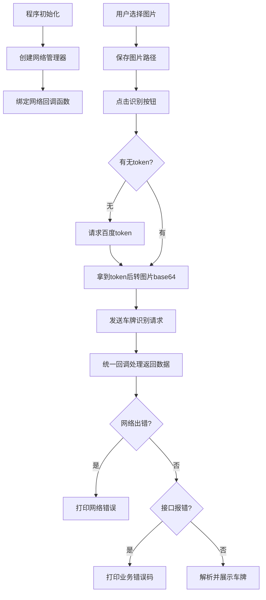
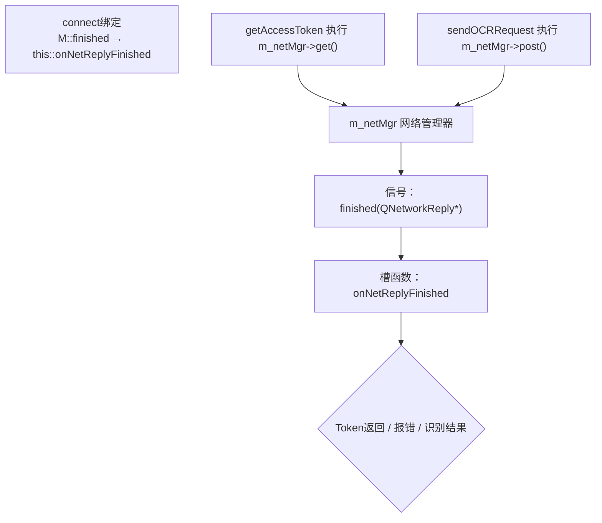

# Qt调用百度API进行操作

## CMakeLists.txt配置

### find_package 追加 Network 组件

`find_package(Qt${QT_VERSION_MAJOR} REQUIRED COMPONENTS Widgets Network)`

`Network` 是 Qt 网络模块，提供 `QNetworkAccessManager`、`QNetworkRequest`、`QNetworkReply` 等类；

### 链接库追加 Qt Network

`target_link_libraries(mycar_identify PRIVATE Qt${QT_VERSION_MAJOR}::Widgets Qt${QT_VERSION_MAJOR}::Network)`

编译时把 Qt Network 库链接进你的可执行程序；


## include相关库文件

### 网络相关头文件

```c++
/ ========== 网络相关头文件（调用百度AI核心）==========
// 网络请求管理器，全局唯一，负责发GET/POST网络请求
#include <QNetworkAccessManager>
// 封装一条HTTP请求（地址、请求头、参数）
#include <QNetworkRequest>
// 单次请求的应答对象，存放服务器返回数据、错误信息
#include <QNetworkReply>

```

### 文件图片弹窗控件头文件

```c++
// ========== 文件、图片、弹窗控件 ==========
// 文件选择对话框：打开本地图片用
#include <QFileDialog>
// 图片类：加载本地图片、缩放显示、转二进制
#include <QImage>
// 弹窗提示（警告、信息弹窗），代码里QMessageBox依赖这个，你现在头文件没加，后面要补上
#include <QMessageBox>
// 文件读写类，读取图片二进制
#include <QFile>
// 调试打印输出
#include <QDebug>
```

### JSON解析头文件

```c++
// ========== JSON解析头文件（解析百度返回数据）==========
// JSON文档顶层容器，整个返回JSON包一层
#include <QJsonDocument>
// JSON对象 {key:value} 格式，取access_token、error_code、车牌信息
#include <QJsonObject>
// JSON数组 [] 格式，识别多张车牌时的列表
#include <QJsonArray>
```

## 变量声明和初始化

### m_netMgr

含义：**全局网络请求管理器**，专门用来发 HTTP GET/POST 请求（调用百度 AI 接口)

`QNetworkAccessManager* m_netMgr`

在构造函数里面的初始化列表进行初始化    m_netMgr(new QNetworkAccessManager(this))  

---

在堆创建网络管理对象

参数 `this` 把当前 MainWindow 设为它的父对象，窗口关闭自动释放网络对象，不用手动删


### connect信号槽绑定

```c++
connect(m_netMgr, &QNetworkAccessManager::finished,
        this, &MainWindow::onNetReplyFinished);
```

- 信号发送者 	                                    网络管理器，只要它发出网络请求（get/post），请求结束（成功 / 失败 / 断网）就会触发 `finished` 信号.
- 信号：`&QNetworkAccessManager::finished`           每次网络请求完成，会携带本次请求的返回数据对象 `QNetworkReply*` 发出去。
- 接收者：`this`			                         接收信号的对象 = 当前 MainWindow 窗口。
- 槽函数：`&MainWindow::onNetReplyFinished`           回调函数，所有百度接口返回数据全部在这里统一处理.
- 

### m_filePath

类型：`QString m_filePath`			作用：保存用户选择的本地图片完整路径


### m_accessToken

QString m_accessToken			    核心作用：百度 AI 鉴权令牌

调用车牌识别接口必须带上这个 token，相当于访问百度接口的 “通行证”，有效期 30 天。


## 加载图片

open图片的按键槽函数

### 弹出文件选择框

获取图片的地址 类型QString

```c++
QString selectPath = QFileDialog::getOpenFileName(
    this,                                  						 // 父窗口，弹窗依附当前窗口
    tr("请选择车牌图片"),                  				       // 弹窗标题
    QDir::homePath(),                      						// 默认打开路径：系统用户主目录（桌面/用户文件夹）
    tr("图片文件 (*.jpg *.jpeg *.png *.bmp)") 					 // 文件过滤器，只显示这几种图片
);
```

### QImage 加载图片

```c++
QImage img(m_filePath);
if(img.isNull())
{
    QMessageBox::warning(this, "图片错误", "图片损坏或格式不支持！");
    m_filePath = "";
    return;
}
```

### 显示图片到label

```c++
ui->label_img->setPixmap(QPixmap::fromImage(img).scaled(
    ui->label_img->size(), Qt::KeepAspectRatio, Qt::SmoothTransformation
));
```

## 识别图片

identify按键槽函数

首先进行判断是否拿到了第一张图片  在判断有无拿到百度token

```c++
if(m_accessToken.isEmpty())
{
    ui->plainText_result->appendPlainText("\n正在向百度服务器获取鉴权令牌...");
    getAccessToken();
}
else
{
    // 有token直接识别
    QString base64Str = imgToBase64(m_filePath);
    if(base64Str.isEmpty())
    {
        ui->plainText_result->appendPlainText("图片编码失败，终止识别");
        return;
    }
    sendOCRRequest(base64Str);
}
```

### getAccessToken()

自己封装的网络请求函数


### imgToBase64 处理图片

```c++
QString MainWindow::imgToBase64(const QString& filePath)
{
    QFile file(filePath);
    if(!file.open(QIODevice::ReadOnly))
    {
        QString err = "图片读取失败，路径含中文/文件损坏：" + filePath;
        ui->plainText_result->appendPlainText(err);
        qDebug() << err;
        return "";
    }
    QByteArray fileData = file.readAll();
    file.close();
    qDebug() << "图片二进制大小(字节)：" << fileData.size();
    if(fileData.isEmpty())
    {
        ui->plainText_result->appendPlainText("错误：图片数据为空，无法上传识别");
        return "";
    }
    return fileData.toBase64();
}
```


### imgToBase64(m_filePath)

工具函数，传入图片路径读取本地图片二进制，转成 Base64 编码字符串；百度 OCR 接口不支持传本地文件，只能上传 Base64 文本,返回值存入 `base64Str` 字符串。

#### 返回空的情况

- 图片损坏
- 读取权限不足
- 文件为空时

因此加以判断是否为空字符串

```c++
if(base64Str.isEmpty())
{
    ui->plainText_result->appendPlainText("图片编码失败，终止识别");
    return;
}
```


### sendOCRRequest识别接口

sendOCRRequest(base64Str);

把转好的图片 Base64 字符串传进去，函数内部拼接带 token 的识别地址、组装 POST 表单、发送网络请求上传图片识别。


## Token获取

### void MainWindow::getAccessToken()

向百度服务器发送 **GET 请求**，换取 `access_token`（接口访问通行证）

#### tokenUrl

- `QUrl`：Qt 专门用来存储、处理网络地址的类；
- 引号内是百度固定 OAuth2 鉴权接口地址，**不能修改**，是百度 AI 统一拿 token 的地址。

QUrl tokenUrl("https://aip.baidubce.com/oauth/2.0/token");

百度接口不能直接传图片，必须先拿 token，有效期 30 天，拿到后缓存 `m_accessToken` 不用重复获取		https://aip.baidubce.com/oauth/2.0/token


#### QUrlQuery

专门拼接 URL 问号后面的参数（`?key=value&key2=value2`），自动处理中文、特殊符号转义，比手动拼接字符串安全。

````c++
QUrlQuery params;
params.addQueryItem("grant_type", "client_credentials");
params.addQueryItem("client_id", API_KEY);
params.addQueryItem("client_secret", SECRET_KEY);
tokenUrl.setQuery(params);
````

三个固定参数:

- `grant_type=client_credentials`：	              固定死，代表 “密钥鉴权模式”。
- `client_id=API_KEY`：			                  百度应用 AK 密钥，类里定义好的常量。
- `client_secret=SECRET_KEY`：                       你的百度应用 SK 密钥；

#### tokenUrl.setQuery(params)

把拼接好的全部参数挂载到 url 地址上，最终完整 url 类似		edge：https://xxx/token?grant_type=client_credentials&client_id=xxx&client_secret=xxx


#### 请求对象

`QNetworkRequest`：封装一条完整 HTTP 请求，把带参数的 url 传进去，构建请求对象。

```c++
QNetworkRequest request(tokenUrl);
```

#### 发送请求

```c++
m_netMgr->get(request);
```

- `-m_netMgr` 全局网络管理器；

- `.get()`：发送 **GET 网络请求**；
-  服务器返回数据后，自动触发之前绑定的 `onNetReplyFinished` 回调函数解析 token。


## 网络异步回调函数 onNetReplyFinished

### reply

入参 `QNetworkReply *reply`，本次网络请求的应答对象，存服务器返回的全部内容；

`reply->readAll()`：一次性读取百度返回的全部字节数据（JSON 字符串），存入二进制容器 `QByteArray rawData`；

网络请求用完必须释放，是延迟销毁应答对象，防止内存泄漏，固定写法。


### 底层网络错误处理

```c++
if(reply->error() != QNetworkReply::NoError)
{
    QString errInfo = QString("网络错误码%1：%2").arg(reply->error()).arg(reply->errorString());
    ui->plainText_result->appendPlainText(errInfo);
    return;
}
```

- `reply->error()`：            获取网络底层错误码；

- `QNetworkReply::NoError`      代表网络通信正常；不等于这个值说明网络层面失败：无网络、防火墙拦截、域名无法访问；

- `arg()`                      字符串格式化，拼接错误码 + 错误描述，打印到界面日志；

- `return`                     直接结束函数，不再解析 JSON。

### JSON 对象

```c++
QJsonDocument jsonDoc = QJsonDocument::fromJson(rawData);
QJsonObject jsonObj = jsonDoc.object();
```

- `QJsonDocument::fromJson(rawData)`：     把原始字节流转成 JSON 文档；

- `.object()`：                           JSON 最外层是大括号 `{}` 对象格式，转成 `QJsonObject`，方便通过 key 读取字段。

### 1 if 

```c++
if(jsonObj.contains("access_token"))
{
    m_accessToken = jsonObj["access_token"].toString();
    ui->plainText_result->appendPlainText("令牌获取成功，调用车牌识别接口");
    qDebug() << "成功拿到token：" << m_accessToken;

    QString base64Str = imgToBase64(m_filePath);
    qDebug() << "图片Base64字符串长度：" << base64Str.size();
    if(base64Str.isEmpty())
    {
        ui->plainText_result->appendPlainText("图片读取失败，无法识别");
        return;
    }
    sendOCRRequest(base64Str);
    return;
}
```


### 2 if

```c++
if(jsonObj.contains("error_code"))
{
    QString errCode = jsonObj["error_code"].toString();
    QString errMsg = jsonObj["error_msg"].toString();
    QString fullErr = QString("百度接口报错[%1]：%2").arg(errCode, errMsg);
    ui->plainText_result->appendPlainText(fullErr);
    return;
}
```


### 3 if

```c++
if(jsonObj.contains("words_result"))
{
    QJsonArray plateArray = jsonObj["words_result"].toArray();
    QString printResult = "====================识别完成====================\n";
    for(auto plateItem : plateArray)
    {
        QJsonObject plateObj = plateItem.toObject();
        printResult += QString("车牌号码：%1\n").arg(plateObj["number"].toString());
        printResult += QString("车牌颜色：%1\n").arg(plateObj["color"].toString());
        printResult += "----------------------------------------\n";
    }
    ui->plainText_result->setPlainText(printResult);
}
```

```
QJsonArray plateArray = jsonObj["words_result"].toArray();
```

`words_result` 是 JSON 数组 `[]`，一张图可能多张车牌，转成 `QJsonArray` 容器；

定义字符串 `printResult` 用来拼接最终展示文本；

范围 for 循环遍历数组中每一张车牌：

- `plateItem` 数组里单个车牌对象，转 `QJsonObject plateObj`；
- `plateObj["number"].toString()`：取出车牌号码；
- `plateObj["color"].toString()`：取出车牌颜色 blue/yellow/green；
- 拼接格式化文字；

```
ui->plainText_result->setPlainText(printResult);
```

`setPlainText` 覆盖文本框原有内容，完整展示所有车牌识别结果


## 已有图片请求调用函数

携带已转好的图片 Base64 字符串，**发送 POST 请求调用百度车牌识别接口**，上传图片并获取车牌信息。

```c++
QString ocrUrlStr = "https://aip.baidubce.com/rest/2.0/ocr/v1/license_plate?access_token=" + m_accessToken;
QUrl ocrUrl(ocrUrlStr);
```

`QUrl ocrUrl(ocrUrlStr)`：把拼接好的完整字符串转为 Qt 网络专用地址对象。


```c++
QString safeBase64 = base64Img;
safeBase64.replace("+", "%2B");
safeBase64.replace("/", "%2F");
safeBase64.replace("=", "%3D");
```

Base64 编码自带三种符号：`+ / =`

HTTP 表单提交时，服务器会把这三个符号当成分隔符解析，直接导致图片参数错乱，百度返回图片格式错误,必须替换成标准 URL 编码。


相关配置

```c++
QUrlQuery postBody;
postBody.addQueryItem("image", safeBase64);
postBody.addQueryItem("multi_detect", "true");
postBody.addQueryItem("detect_complete", "false");
postBody.addQueryItem("detect_risk", "false");
```

`QUrlQuery` 在这里用来构建 POST 表单 `x-www-form-urlencoded` 格式数据，每个 `addQueryItem("参数名","值")` 对应百度接口文档参数

image（必填核心参数） 值是转义后的图片 Base64 字符串，上传图片全靠这个参数；

multi_detect`：`true    开启多车牌检测，一张图片里识别全部车牌；设为 false 只识别画面最清晰一张；

detect_complete`：`false   是否只识别完整无遮挡车牌；false 允许识别部分遮挡、截断车牌；

detect_risk`：`false        风险车辆（黑名单）检测，不需要就关闭，减少接口耗时。


把参数转为 POST 提交字节流 + 构造请求

```c++
QByteArray postData = postBody.toString(QUrl::FullyEncoded).toUtf8();
QNetworkRequest request(ocrUrl);
request.setRawHeader("Content-Type", "application/x-www-form-urlencoded");
```

发送 POST 网络请求

```
m_netMgr->post(request, postData);
ui->plainText_result->appendPlainText("开始识别图片车牌...");
```

## 总体流程







